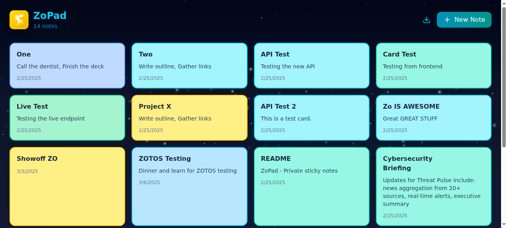

# ZoPad — Private Sticky Notes for Zo Space

A personal sticky notes app that runs on your Zo Computer. Notes are stored server-side on **your** machine — no shared databases, no cross-user data, fully private.

## Features

- 🗒️ Create, edit, delete sticky notes
- 🎨 8 color options (yellow, cyan, teal, green, blue, ocean, electric, purple)
- 📱 Create notes via SMS or chat — just text "Sticky: pick up groceries"
- 💾 Server-side storage — works across browsers and devices
- 📦 Export notes as JSON backup
- 🔒 Private by design — each Zo Computer is isolated
- 🌌 Milky Way space theme with animated starfield

## Quick Install

In your Zo chat, say:

> *"Install the ZoPad skill and deploy it"*

Or manually:

### 1. Create the API route

Create a new **API route** at `/api/stickies` using the code in [`routes/api-stickies.ts`](routes/api-stickies.ts)

### 2. Create the page

Create a new **page route** at `/stickies` using the code in [`routes/page-stickies.tsx`](routes/page-stickies.tsx)

### 3. (Optional) Enable SMS note creation

Add a Zo rule:
- **Condition:** User asks to create a sticky, note, post-it, or ZoPad entry
- **Instruction:** Create it by running: `curl -s -X POST http://localhost:3099/api/stickies -H "Content-Type: application/json" -H "Accept: application/json" -d '{"title":"<title>","content":"<content>","color":"<color>"}'`. Use "yellow" as default color unless specified.

## Privacy & Data Isolation

- Notes live in `/home/workspace/Space/postits/notes.json` on **your server only**
- No data is shared between Zo Computer instances
- Fresh install = empty board — no sample data, no cross-contamination
- The file is auto-created on first note — zero setup required

## API Reference

| Method | Endpoint | Body | Description |
|--------|----------|------|-------------|
| `GET` | `/api/stickies` | — | List all notes |
| `POST` | `/api/stickies` | `{title, content, color}` | Create a note |
| `PUT` | `/api/stickies` | `{id, title?, content?, color?}` | Update a note |
| `DELETE` | `/api/stickies?id=<id>` | — | Delete a note |

## Tech Stack

- **Frontend:** React + Tailwind CSS (Zo Space page route)
- **Backend:** Hono API route (Zo Space API route)
- **Storage:** JSON file on local filesystem
- **Runtime:** Bun

## License

MIT
