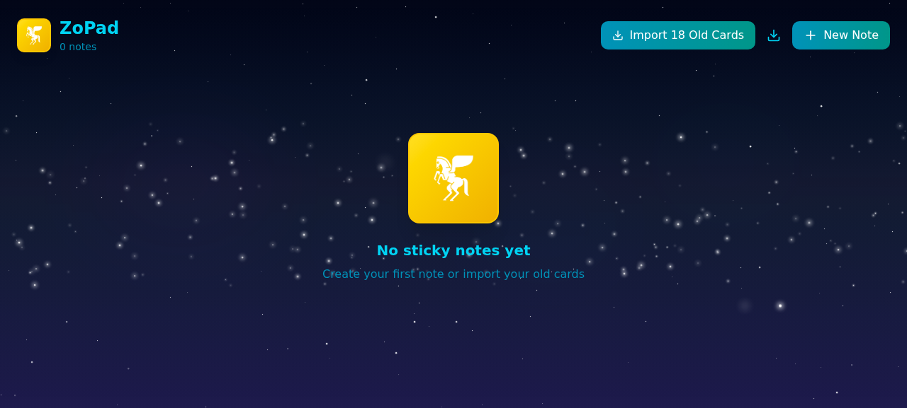

# 📝 ZoPad

A beautiful, private sticky notes app with a cosmic Milky Way background. Built with React + TypeScript on [Zo Computer](https://zocomputer.com).



## Features

- 🌌 Milky Way star field with shooting stars and nebulae
- 🎨 8 color options for your notes (yellow, cyan, teal, green, blue, ocean, electric, purple)
- ✏️ Create, edit, and delete sticky notes
- 💾 All data saved locally in your browser (localStorage) — your notes never leave your device
- 📦 Export/import your notes as JSON backups
- 📱 Responsive grid layout (1–4 columns)
- ⚡ Zero backend required — runs entirely in your browser

## Quick Install on Zo Computer

If you have a [Zo Computer](https://zocomputer.com), just ask Zo:

> "Install ZoPad from https://github.com/KaiyzerBX50/ZoPad"

Or manually:

1. Go to your Zo Computer chat
2. Say: **"Create a new page route at `/stickies` using the code from this file"** and paste the contents of `src/ZoPad.tsx`

That's it — your ZoPad will be live at `https://yourhandle.zo.space/stickies`

## Install Anywhere (Standalone)

### Prerequisites

- [Node.js](https://nodejs.org/) 18+ or [Bun](https://bun.sh/)

### Steps

```bash
git clone https://github.com/KaiyzerBX50/ZoPad.git
cd ZoPad
npm install
npm run dev
```

Open [http://localhost:5173](http://localhost:5173) in your browser.

### Build for Production

```bash
npm run build
```

Static files will be in `dist/` — deploy anywhere (Vercel, Netlify, GitHub Pages, etc).

## Project Structure

```
ZoPad/
├── src/
│   └── ZoPad.tsx          # Main component (self-contained)
├── index.html             # Entry point
├── package.json           # Dependencies
├── vite.config.ts         # Vite config
├── tsconfig.json          # TypeScript config
├── tailwind.config.js     # Tailwind CSS config
├── postcss.config.js      # PostCSS config
└── public/
    └── pegasus.png        # Zo Pegasus logo
```

## Privacy

ZoPad stores all notes in your browser's localStorage. No server, no database, no tracking. Your data is yours.

## Export & Backup

Click the download icon in the header to export all your notes as a JSON file. You can re-import them anytime.

## License

MIT

## Credits

Built with ❤️ on [Zo Computer](https://zocomputer.com) by [@dagawdnyc](https://dagawdnyc.zo.computer)
